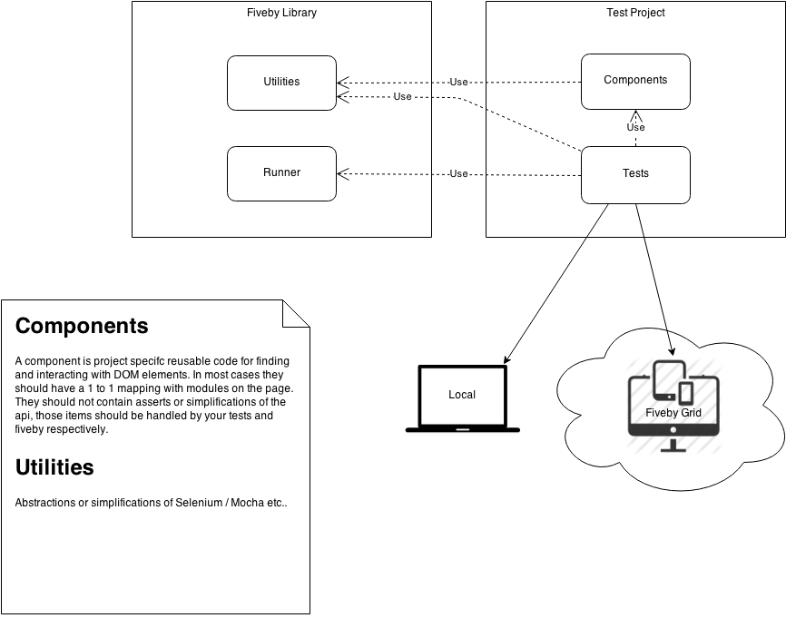

####1. Introduction

  Automated browser testing is writing code to simulation a user: click element x, wait for event y, click again, assert results, repeat.

####2. Project Structure - the important part to note here is the distinction between tests and components. Components abstract the dom details from the tests using the [page objects pattern](pop.md). You can see some real projects [here](https://github.dowjones.net/factivaautomation). Keep in mind other projects are immature as well and probably DO NOT follow many of the best practices discussed here... and suffered for it!

```
  └── tests
  │   ├── alert
  │   │   ├── regression
  │   │   │   └── ...
  │   │   └── smoke
  │   │       └── ...
  │   ├── login
  │   │   └── smoke
  │   │       └── ...
  │   ├── search
  │   │   └── smoke
  │   │       └── ...
  │   └── searchbuilder
  │       └── smoke
  │           └── ...
  │
  └── components
      ├── BaseComponent.js
      ├── CommonConfig.js
      ├── ModalComponent.js
      ├── PageComponent.js
      ├── ...
      ├── alert
      │   └── ...
      ├── listeditor
      │   └── ...
      ├── login
      │   └── ...
      ├── search
      │   └── ...
      └── searchbuilder
          └── ...
```  

####4. Bad Practices
  - Don't use callbacks. Selenium is promise based and Mocha is promise friendly. Mixing them is ugly and hard to understand. If you don't know how to do something cleanly with promises discuss with someone who does.
  - Don't execute javascript in the browser, your tests should rely 100% on DOM interaction. Remember you are emulating a user! Direct javascript makes for brittle and ugly tests.

####5. [Code Style & API](api.md)

####6.[External Dependencies](docs/external-dependencies.md)

####7. Based on:

*Selenium Javascript* api:

> http://selenium.googlecode.com/git/docs/api/javascript/index.html
> (webdriver.By and webdriver.promise surfaced as globals for convience)

*Mocha BDD* api:

> describe(), it(), before(), after(), beforeEach(), and afterEach()
> http://visionmedia.github.io/mocha

*should.js* api:

> https://github.com/shouldjs/should.js


####8. Ecosystem



####9. [FAQ](/docs/faq.md)
